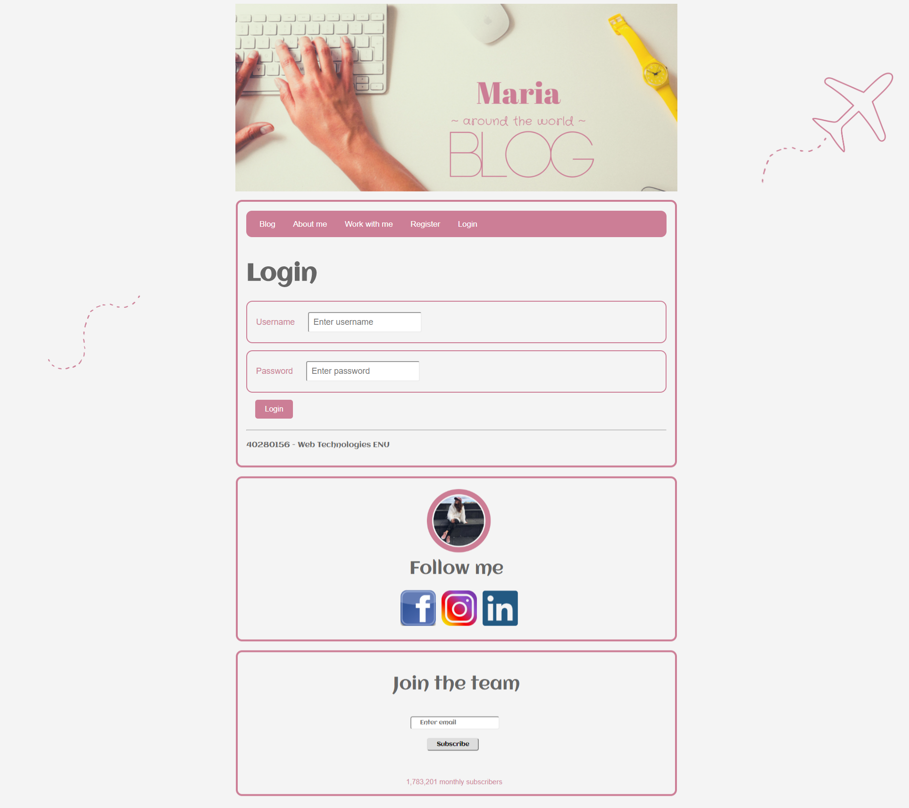
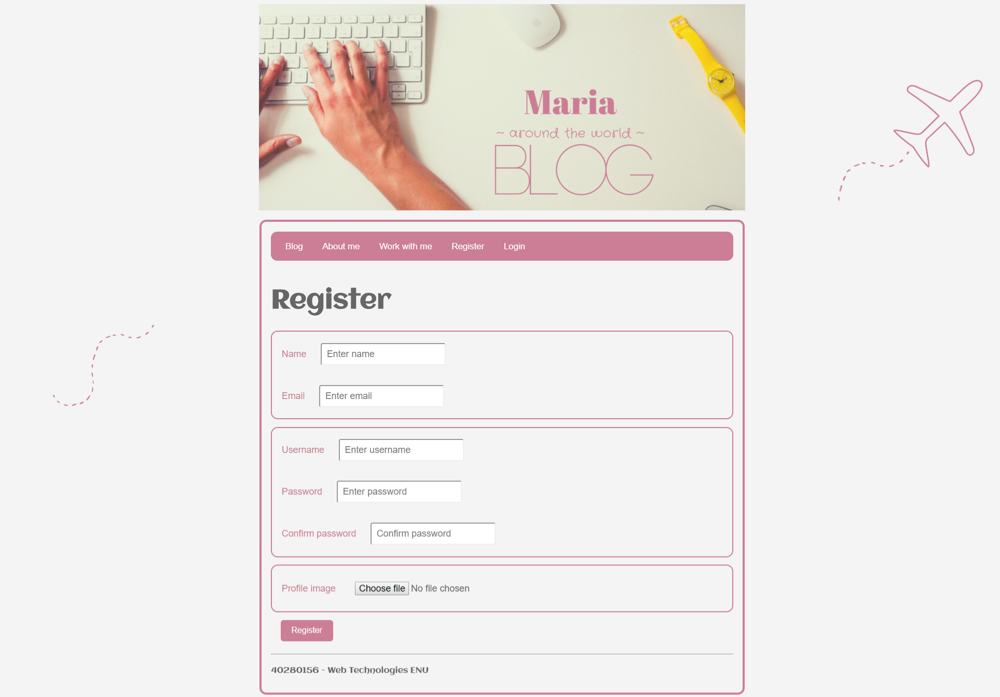
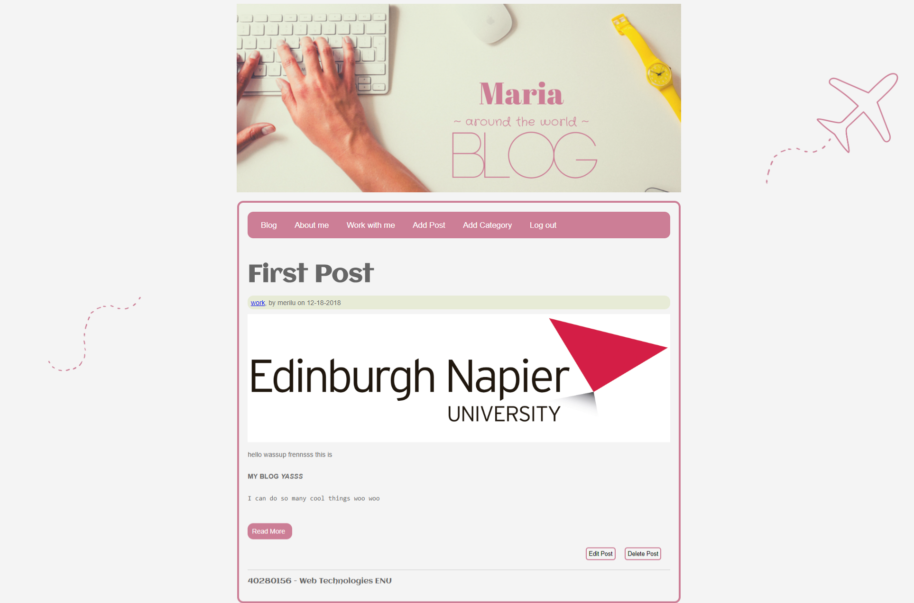
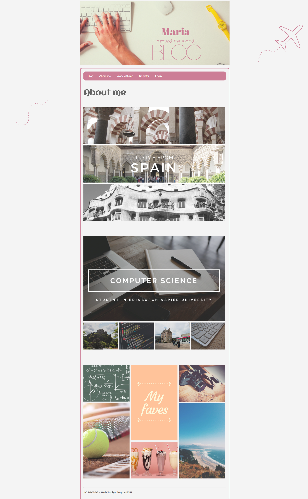
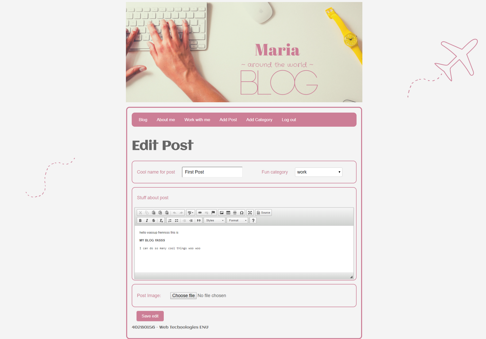

# Blog system in Node.JS
Web Technologies coursework 2

To run the blog in your web browser:


**MongoDB should be installed.**
**Node.Js should be installed.**

To start:
- open the Command prompt as admin
- go to the directory where mongo is saved, go into bin and run mongo by typing 'mongo' (start running mongo) 
```
C:\mongodb\bin>mongo
```
- do not close that cmd

- open another cmd as admin
- download this project and go to that foler in the cmd
- in my case, the project folder is in the C drive, in a folder called Projects
```
C:\>
C:\> cd Projects\Node_JS_Blog
C:\Projects\Node_JS_Blog>
```
- type the following commands (npm install and npm start)

```
C:\Projects\Node_JS_Blog> npm install
C:\Projects\Node_JS_Blog> npm start
```

- go to google chrome
- open localhost:3000

The program will automatically take you to localhost:3000/users/login

**To post:**
1. Register
2. Login
3. Add category
4. Add post

**Blog Report is in the main folder**


##Screenshots











